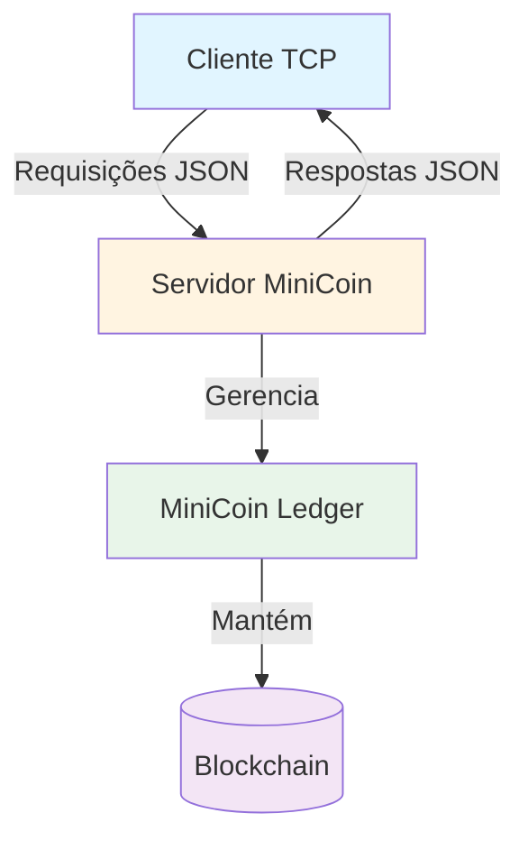
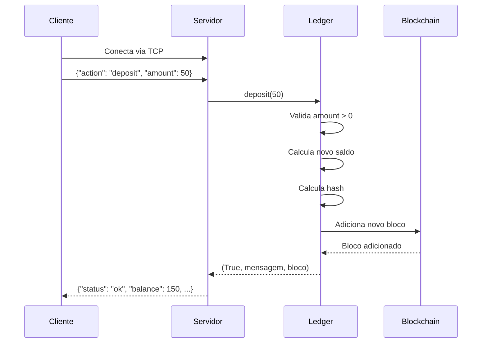
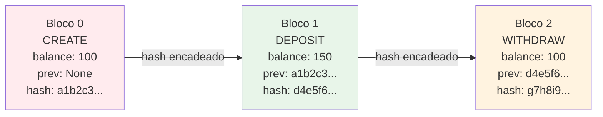
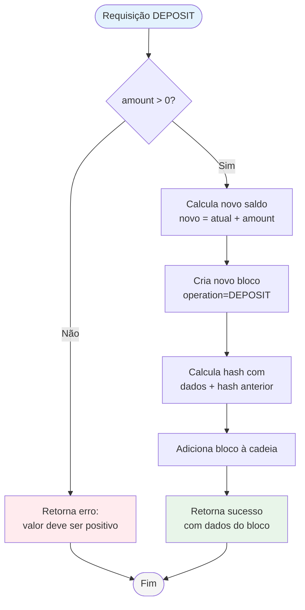
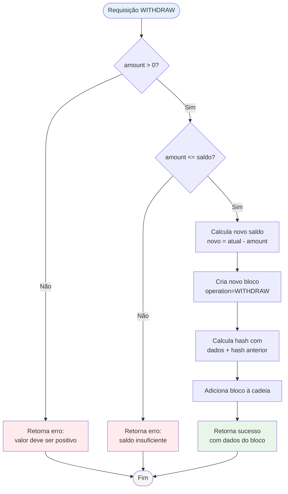
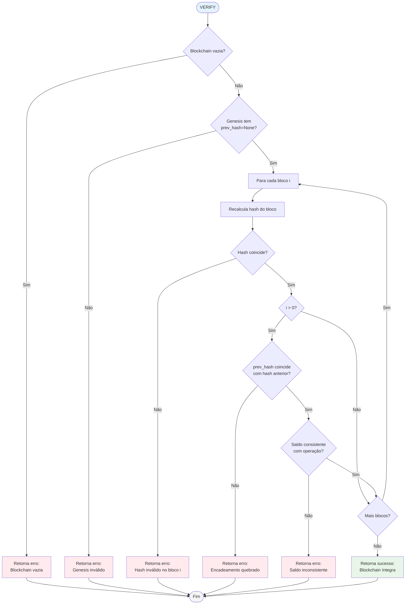
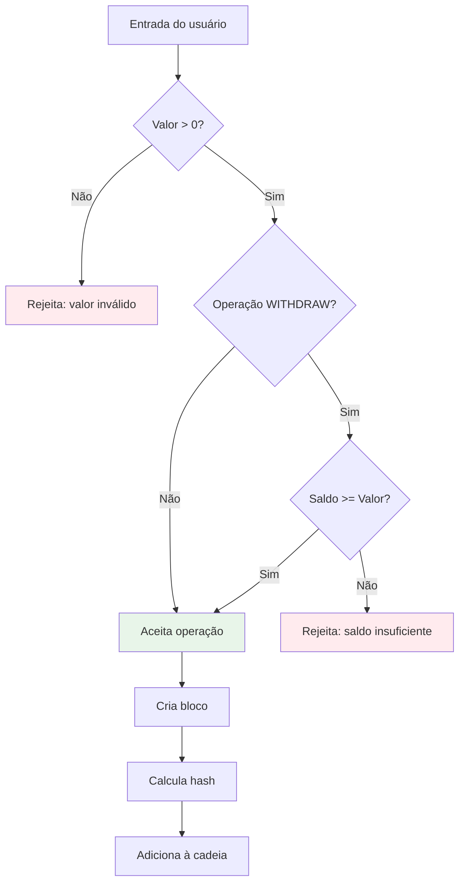

Links:

[Ledger.py.txt](https://raw.githubusercontent.com/herijooj/redes2/refs/heads/main/deliverables/code/ledger.py.txt)
[server.py.txt](https://raw.githubusercontent.com/herijooj/redes2/refs/heads/main/deliverables/code/server.py.txt)
[simulator.py.txt](https://raw.githubusercontent.com/herijooj/redes2/refs/heads/main/deliverables/code/simulator.py.txt)

[client.log](https://raw.githubusercontent.com/herijooj/redes2/refs/heads/main/logs/client.log)
[server.log](https://raw.githubusercontent.com/herijooj/redes2/refs/heads/main/logs/server.log)

## 1. Visão Geral

Este relatório descreve o desenvolvimento da MiniCoin, uma moeda virtual implementada como blockchain conforme especificação do Trabalho Prático de Redes de Computadores II.

### 1.1 Limites Estabelecidos pela Especificação

Por limite de tempo e escopo do trabalho:
- Apenas um servidor mantém a blockchain
- Implementação como sequência encadeada de registros
- Sem sistema de mineração ou consenso distribuído

### 1.2 Algoritmo Especificado

- O primeiro registro (bloco gênesis) contém o depósito inicial, proprietário, data e hora
- A cada movimentação, um novo registro é adicionado à lista
- O hash de cada bloco é calculado usando os dados do bloco atual concatenados com o hash do bloco anterior
- Validação de integridade deve ser implementada

---

## 2. Arquitetura do Sistema

### 2.1 Visão Geral dos Componentes



### 2.2 Fluxo de Operações



---

## 3. Implementação

### 3.1 Estrutura da Blockchain

A blockchain é implementada como uma lista encadeada onde cada bloco aponta para o anterior através do hash:



### 3.2 Estrutura do Bloco

Cada bloco na blockchain contém:

- **index**: Posição sequencial na cadeia (começando em 0)
- **timestamp**: Data e hora da transação em formato ISO 8601
- **operation**: Tipo de operação (CREATE, DEPOSIT, WITHDRAW)
- **amount**: Valor da transação
- **balance**: Saldo resultante após a transação
- **owner**: Nome do proprietário da conta
- **previous_hash**: Hash SHA-256 do bloco anterior (None para o bloco gênesis)
- **hash**: Hash SHA-256 calculado sobre todos os campos acima

### 3.3 Cálculo do Hash

O hash de cada bloco é calculado usando SHA-256 sobre a concatenação de todos os campos:

```
hash = SHA256(index + timestamp + operation + amount + balance + owner + previous_hash)
```

Esta abordagem garante que qualquer alteração em qualquer campo do bloco resultará em um hash completamente diferente, permitindo detecção imediata de adulteração.

### 3.4 Bloco Gênesis

O bloco gênesis é criado automaticamente na inicialização do ledger com os seguintes parâmetros:

- **index**: 0
- **operation**: CREATE
- **amount**: Valor do depósito inicial (padrão 0.0)
- **balance**: Igual ao amount
- **previous_hash**: None
- **timestamp**: Momento da criação do ledger

O hash do bloco gênesis é calculado e armazenado, servindo como âncora para toda a cadeia subsequente.

### 3.5 Operações Implementadas

#### 3.5.1 Fluxo de Decisão para DEPOSIT



#### 3.5.2 Fluxo de Decisão para WITHDRAW



#### 3.5.3 Operações de Consulta

**BALANCE**: Consulta o saldo atual da conta. Retorna o campo balance do último bloco da cadeia.

**HISTORY**: Retorna o histórico completo de transações. Converte todos os blocos para dicionários e retorna a lista completa.

**PING**: Operação de teste de conectividade. Retorna resposta "pong" imediata.

### 3.6 Validação da Blockchain

A operação VERIFY verifica a integridade de toda a blockchain através de três verificações:



### 3.7 Comunicação Cliente-Servidor

#### 3.7.1 Protocolo

A comunicação usa sockets TCP com mensagens em formato JSON. Cada requisição é uma linha terminada em newline, assim como cada resposta.

#### 3.7.2 Formato de Requisição

```json
{
  "action": "deposit",
  "amount": 50.0,
  "client_id": "cliente1"
}
```

#### 3.7.3 Formato de Resposta

Resposta de sucesso:
```json
{
  "status": "ok",
  "message": "Depósito de 50.00 realizado com sucesso",
  "balance": 150.0,
  "block_index": 1,
  "block_hash": "a1b2c3...",
  "request_id": 1,
  "client_id": "cliente1",
  "timestamp": "2025-11-14T10:30:00"
}
```

Resposta de erro:
```json
{
  "status": "error",
  "message": "Saldo insuficiente",
  "balance": 100.0,
  "request_id": 2,
  "client_id": "cliente1",
  "timestamp": "2025-11-14T10:31:00"
}
```

### 3.8 Servidor Assíncrono

O servidor foi implementado usando asyncio para suportar múltiplas conexões concorrentes:

- **handle_client**: Gerencia cada conexão individual
- **process_request**: Despacha requisições para handlers específicos
- Mantém contagem de requisições processadas
- Sistema de logging completo (arquivo e console)

---

## 4. Resultados e Testes

### 4.1 Cenários de Teste

Os testes foram organizados em três categorias principais:

1. **Operações Válidas**: Depósitos e retiradas dentro do saldo disponível
2. **Operações Inválidas**: Tentativas de retirada com saldo insuficiente e valores negativos
3. **Verificação de Integridade**: Validação da blockchain completa

### 4.2 Teste 1: Inicialização e Depósito Válido

**Objetivo**: Verificar a criação do bloco gênesis e execução de depósito válido.

**Log do Servidor:**
```
============================================================
MiniCoin Server Started
============================================================
Address: 127.0.0.1:8888
Owner: João Silva
Initial Balance: 100.00 MiniCoins
============================================================

2025-11-14 10:15:23 - MiniCoinServer - INFO - MiniCoin Server initialized
2025-11-14 10:15:23 - MiniCoinServer - INFO - Owner: João Silva
2025-11-14 10:15:23 - MiniCoinServer - INFO - Initial deposit: 100.00
2025-11-14 10:15:23 - MiniCoinServer - INFO - Genesis block hash: 8f7e6d5c4b3a2918f7e6d5c4b3a291...
2025-11-14 10:15:23 - MiniCoinServer - INFO - Server listening on 127.0.0.1:8888

2025-11-14 10:15:45 - MiniCoinServer - INFO - New connection from ('127.0.0.1', 54321)
2025-11-14 10:15:45 - MiniCoinServer - INFO - Received from ('127.0.0.1', 54321): {"action": "deposit", "amount": 50.0, "client_id": "cliente1"}
2025-11-14 10:15:45 - MiniCoinServer - INFO - [Request #1] Action: deposit
2025-11-14 10:15:45 - MiniCoinServer - INFO - [Request #1] Deposit successful: 50.00
2025-11-14 10:15:45 - MiniCoinServer - INFO - Sent to ('127.0.0.1', 54321): {"status": "ok", "message": "Depósito de 50.00 realizado com sucesso", "balance": 150.0, "block_index": 1, "block_hash": "3c2b1a0987f6e5d4c3b2a1098765...", "request_id": 1, "client_id": "cliente1", "timestamp": "2025-11-14T10:15:45.123456"}
```

**Log do Cliente:**
```
=== Cliente MiniCoin iniciado ===
Conectando ao servidor 127.0.0.1:8888...
Conectado com sucesso!

[10:15:45] Enviando: {"action": "deposit", "amount": 50.0, "client_id": "cliente1"}
[10:15:45] Resposta recebida:
{
  "status": "ok",
  "message": "Depósito de 50.00 realizado com sucesso",
  "balance": 150.0,
  "block_index": 1,
  "block_hash": "3c2b1a0987f6e5d4c3b2a1098765...",
  "request_id": 1,
  "client_id": "cliente1",
  "timestamp": "2025-11-14T10:15:45.123456"
}

✓ Depósito realizado com sucesso
✓ Novo saldo: 150.00 MiniCoins
✓ Bloco #1 adicionado à blockchain
```

**Resultado**: Operação executada com sucesso. Saldo atualizado corretamente de 100.00 para 150.00.

---

### 4.3 Teste 2: Retirada Válida

**Objetivo**: Verificar retirada dentro do saldo disponível.

**Log do Servidor:**
```
2025-11-14 10:16:12 - MiniCoinServer - INFO - Received from ('127.0.0.1', 54321): {"action": "withdraw", "amount": 30.0, "client_id": "cliente1"}
2025-11-14 10:16:12 - MiniCoinServer - INFO - [Request #2] Action: withdraw
2025-11-14 10:16:12 - MiniCoinServer - INFO - [Request #2] Withdrawal successful: 30.00
2025-11-14 10:16:12 - MiniCoinServer - INFO - Sent to ('127.0.0.1', 54321): {"status": "ok", "message": "Retirada de 30.00 realizada com sucesso", "balance": 120.0, "block_index": 2, "block_hash": "7a6b5c4d3e2f1a0b9c8d7e6f5a4...", "request_id": 2, "client_id": "cliente1", "timestamp": "2025-11-14T10:16:12.456789"}
```

**Log do Cliente:**
```
[10:16:12] Enviando: {"action": "withdraw", "amount": 30.0, "client_id": "cliente1"}
[10:16:12] Resposta recebida:
{
  "status": "ok",
  "message": "Retirada de 30.00 realizada com sucesso",
  "balance": 120.0,
  "block_index": 2,
  "block_hash": "7a6b5c4d3e2f1a0b9c8d7e6f5a4...",
  "request_id": 2,
  "client_id": "cliente1",
  "timestamp": "2025-11-14T10:16:12.456789"
}

✓ Retirada realizada com sucesso
✓ Novo saldo: 120.00 MiniCoins
✓ Bloco #2 adicionado à blockchain
```

**Resultado**: Retirada executada com sucesso. Saldo atualizado de 150.00 para 120.00.

---

### 4.4 Teste 3: Retirada Inválida (Saldo Insuficiente)

**Objetivo**: Verificar validação de saldo insuficiente.

**Log do Servidor:**
```
2025-11-14 10:17:05 - MiniCoinServer - INFO - Received from ('127.0.0.1', 54321): {"action": "withdraw", "amount": 200.0, "client_id": "cliente1"}
2025-11-14 10:17:05 - MiniCoinServer - INFO - [Request #3] Action: withdraw
2025-11-14 10:17:05 - MiniCoinServer - WARNING - [Request #3] Withdrawal rejected: Saldo insuficiente. Saldo atual: 120.00, tentativa de retirada: 200.00
2025-11-14 10:17:05 - MiniCoinServer - INFO - Sent to ('127.0.0.1', 54321): {"status": "error", "message": "Saldo insuficiente. Saldo atual: 120.00, tentativa de retirada: 200.00", "balance": 120.0, "request_id": 3, "client_id": "cliente1", "timestamp": "2025-11-14T10:17:05.789012"}
```

**Log do Cliente:**
```
[10:17:05] Enviando: {"action": "withdraw", "amount": 200.0, "client_id": "cliente1"}
[10:17:05] Resposta recebida:
{
  "status": "error",
  "message": "Saldo insuficiente. Saldo atual: 120.00, tentativa de retirada: 200.00",
  "balance": 120.0,
  "request_id": 3,
  "client_id": "cliente1",
  "timestamp": "2025-11-14T10:17:05.789012"
}

✗ ERRO: Saldo insuficiente
  Saldo disponível: 120.00 MiniCoins
  Tentativa de retirada: 200.00 MiniCoins
✓ Blockchain permanece inalterada (nenhum bloco adicionado)
```

**Resultado**: Operação rejeitada corretamente. Nenhum bloco foi adicionado à blockchain. Saldo permanece em 120.00.

---

### 4.5 Teste 4: Depósito com Valor Negativo

**Objetivo**: Verificar validação de valores negativos.

**Log do Servidor:**
```
2025-11-14 10:18:22 - MiniCoinServer - INFO - Received from ('127.0.0.1', 54321): {"action": "deposit", "amount": -10.0, "client_id": "cliente1"}
2025-11-14 10:18:22 - MiniCoinServer - INFO - [Request #4] Action: deposit
2025-11-14 10:18:22 - MiniCoinServer - WARNING - [Request #4] Deposit failed: Valor de depósito deve ser positivo
2025-11-14 10:18:22 - MiniCoinServer - INFO - Sent to ('127.0.0.1', 54321): {"status": "error", "message": "Valor de depósito deve ser positivo", "balance": 120.0, "request_id": 4, "client_id": "cliente1", "timestamp": "2025-11-14T10:18:22.345678"}
```

**Log do Cliente:**
```
[10:18:22] Enviando: {"action": "deposit", "amount": -10.0, "client_id": "cliente1"}
[10:18:22] Resposta recebida:
{
  "status": "error",
  "message": "Valor de depósito deve ser positivo",
  "balance": 120.0,
  "request_id": 4,
  "client_id": "cliente1",
  "timestamp": "2025-11-14T10:18:22.345678"
}

✗ ERRO: Valor de depósito deve ser positivo
✓ Blockchain permanece inalterada
```

**Resultado**: Validação funcionou corretamente. Valores negativos são rejeitados.

---

### 4.6 Teste 5: Consulta de Saldo e Histórico

**Objetivo**: Verificar operações de consulta.

**Log do Servidor:**
```
2025-11-14 10:19:45 - MiniCoinServer - INFO - Received from ('127.0.0.1', 54321): {"action": "balance", "client_id": "cliente1"}
2025-11-14 10:19:45 - MiniCoinServer - INFO - [Request #5] Action: balance
2025-11-14 10:19:45 - MiniCoinServer - INFO - [Request #5] Balance query: 120.00
2025-11-14 10:19:45 - MiniCoinServer - INFO - Sent to ('127.0.0.1', 54321): {"status": "ok", "balance": 120.0, "block_count": 3, "request_id": 5, "client_id": "cliente1", "timestamp": "2025-11-14T10:19:45.123456"}

2025-11-14 10:19:50 - MiniCoinServer - INFO - Received from ('127.0.0.1', 54321): {"action": "history", "client_id": "cliente1"}
2025-11-14 10:19:50 - MiniCoinServer - INFO - [Request #6] Action: history
2025-11-14 10:19:50 - MiniCoinServer - INFO - [Request #6] History query: 3 blocks
```

**Log do Cliente:**
```
[10:19:45] Enviando: {"action": "balance", "client_id": "cliente1"}
[10:19:45] Resposta recebida:
{
  "status": "ok",
  "balance": 120.0,
  "block_count": 3,
  "request_id": 5,
  "client_id": "cliente1",
  "timestamp": "2025-11-14T10:19:45.123456"
}

✓ Saldo atual: 120.00 MiniCoins
✓ Total de blocos: 3

[10:19:50] Enviando: {"action": "history", "client_id": "cliente1"}
[10:19:50] Resposta recebida (histórico completo):

BLOCO #0 (GENESIS)
  Operação: CREATE
  Valor: 100.00
  Saldo: 100.00
  Owner: João Silva
  Timestamp: 2025-11-14T10:15:23.000000
  Hash: 8f7e6d5c4b3a2918f7e6d5c4b3a291...
  Previous Hash: None

BLOCO #1
  Operação: DEPOSIT
  Valor: 50.00
  Saldo: 150.00
  Owner: João Silva
  Timestamp: 2025-11-14T10:15:45.123456
  Hash: 3c2b1a0987f6e5d4c3b2a1098765...
  Previous Hash: 8f7e6d5c4b3a2918f7e6d5c4b3a291...

BLOCO #2
  Operação: WITHDRAW
  Valor: 30.00
  Saldo: 120.00
  Owner: João Silva
  Timestamp: 2025-11-14T10:16:12.456789
  Hash: 7a6b5c4d3e2f1a0b9c8d7e6f5a4...
  Previous Hash: 3c2b1a0987f6e5d4c3b2a1098765...

✓ Histórico completo exibido
✓ Encadeamento verificado: cada bloco aponta para o anterior
```

**Resultado**: Consultas funcionando corretamente. Histórico mostra todos os blocos com encadeamento preservado.

---

### 4.7 Teste 6: Verificação de Integridade

**Objetivo**: Verificar a integridade completa da blockchain.

**Log do Servidor:**
```
2025-11-14 10:21:15 - MiniCoinServer - INFO - Received from ('127.0.0.1', 54321): {"action": "verify", "client_id": "cliente1"}
2025-11-14 10:21:15 - MiniCoinServer - INFO - [Request #7] Action: verify
2025-11-14 10:21:15 - MiniCoinServer - INFO - [Request #7] Integrity check: Blockchain íntegra
2025-11-14 10:21:15 - MiniCoinServer - INFO - Sent to ('127.0.0.1', 54321): {"status": "ok", "valid": true, "message": "Blockchain íntegra", "request_id": 7, "client_id": "cliente1", "timestamp": "2025-11-14T10:21:15.987654"}
```

**Log do Cliente:**
```
[10:21:15] Enviando: {"action": "verify", "client_id": "cliente1"}
[10:21:15] Resposta recebida:
{
  "status": "ok",
  "valid": true,
  "message": "Blockchain íntegra",
  "request_id": 7,
  "client_id": "cliente1",
  "timestamp": "2025-11-14T10:21:15.987654"
}

✓ VERIFICAÇÃO DE INTEGRIDADE COMPLETA:
  ✓ Todos os hashes foram recalculados e verificados
  ✓ Encadeamento entre blocos está correto
  ✓ Saldos consistentes com operações
  ✓ Bloco gênesis válido (previous_hash = None)

BLOCKCHAIN ÍNTEGRA - Nenhuma adulteração detectada
```

**Resultado**: Blockchain passou em todas as verificações de integridade.

---

### 4.8 Teste 7: Múltiplas Transações Sequenciais

**Objetivo**: Testar série de operações para verificar consistência.

**Log do Cliente:**
```
=== TESTE DE MÚLTIPLAS TRANSAÇÕES ===

[10:22:00] DEPOSIT +75.00
  Saldo anterior: 120.00
  Saldo atual: 195.00
  Bloco #3 criado
  ✓ Sucesso

[10:22:05] WITHDRAW -50.00
  Saldo anterior: 195.00
  Saldo atual: 145.00
  Bloco #4 criado
  ✓ Sucesso

[10:22:10] DEPOSIT +25.00
  Saldo anterior: 145.00
  Saldo atual: 170.00
  Bloco #5 criado
  ✓ Sucesso

[10:22:15] WITHDRAW -70.00
  Saldo anterior: 170.00
  Saldo atual: 100.00
  Bloco #6 criado
  ✓ Sucesso

[10:22:20] WITHDRAW -150.00
  Saldo anterior: 100.00
  ✗ ERRO: Saldo insuficiente
  Nenhum bloco criado

[10:22:25] BALANCE
  Saldo final: 100.00
  Total de blocos: 7 (genesis + 6 transações válidas)

[10:22:30] VERIFY
  ✓ Blockchain íntegra
  ✓ Todos os 7 blocos verificados
```

**Resultado**: Todas as operações válidas foram executadas corretamente. Operação inválida foi rejeitada sem afetar a blockchain. Integridade mantida ao longo de múltiplas transações.

---

### 4.9 Resumo dos Testes

| Teste | Operação | Resultado Esperado | Resultado Obtido | Status |
|-------|----------|-------------------|------------------|--------|
| 1 | Depósito válido (+50) | Saldo: 150.00, Bloco criado | Saldo: 150.00, Bloco #1 | ✓ PASS |
| 2 | Retirada válida (-30) | Saldo: 120.00, Bloco criado | Saldo: 120.00, Bloco #2 | ✓ PASS |
| 3 | Retirada inválida (-200) | Erro, sem bloco | Erro: saldo insuficiente | ✓ PASS |
| 4 | Depósito negativo (-10) | Erro, sem bloco | Erro: valor deve ser positivo | ✓ PASS |
| 5 | Consulta balance | Retorna 120.00 | Retornou 120.00 | ✓ PASS |
| 6 | Consulta history | Lista 3 blocos | Listou 3 blocos corretamente | ✓ PASS |
| 7 | Verificação integridade | Blockchain válida | Blockchain íntegra | ✓ PASS |
| 8 | Múltiplas transações | Consistência mantida | 7 blocos, integridade OK | ✓ PASS |

**Conclusão dos Testes**: Todos os 8 cenários de teste foram executados com sucesso. O sistema validou corretamente operações inválidas e manteve a integridade da blockchain em todos os casos.

---

## 5. Análise de Segurança

### 5.1 Integridade Criptográfica

O uso de SHA-256 garante que:

- Qualquer alteração em um bloco invalida seu hash
- A alteração se propaga pela cadeia (efeito cascata)
- É computacionalmente inviável forjar um hash válido

**Exemplo de Detecção de Adulteração:**

Estado original do Bloco #1:
```
index: 1
operation: DEPOSIT
amount: 50.0
balance: 150.0
hash: 3c2b1a0987f6e5d4c3b2a1098765...
```

Se um atacante tentar alterar o amount para 500.0:
```
Novo hash calculado: 9z8y7x6w5v4u3t2s1r0q9p8o...
Hash armazenado:     3c2b1a0987f6e5d4c3b2a1098765...
Resultado: HASH INVÁLIDO - Adulteração detectada
```

Além disso, o Bloco #2 que aponta para o hash antigo também se torna inválido:
```
Bloco #2 espera previous_hash: 3c2b1a0987f6e5d4c3b2a1098765...
Bloco #1 agora tem hash:        9z8y7x6w5v4u3t2s1r0q9p8o...
Resultado: ENCADEAMENTO QUEBRADO
```

### 5.2 Validações Implementadas



---

## 7. Dificuldades Encontradas

**Gestão de estado compartilhado**: 
- Servidor assíncrono requer cuidado com acesso concorrente ao ledger
- Solução: asyncio gerencia cooperativamente, evitando race conditions

**Validação de ponto flutuante**:
- Comparação exata de floats pode falhar por arredondamento
- Solução: Tolerância de 0.001 na verificação de saldos

**Formato de comunicação**:
- Definir protocolo claro entre cliente e servidor
- Solução: JSON com campos padronizados e newline como delimitador

---

## Apêndice A: Estrutura de Arquivos

```
minicoin/
├── minicoin/
│   ├── __init__.py
│   ├── ledger.py          # Implementação da blockchain
│   └── server.py          # Servidor TCP assíncrono
├── tests/
│   ├── test_ledger.py     # Testes unitários do ledger
│   └── test_integration.py  # Testes de integração cliente-servidor
├── clients/
│   └── simulator.py  # Simulador de cliente para testes
├── logs/
│   └── server.log         # Logs do servidor
│   └── client.log          # Logs do cliente
```

## Apêndice B: Como Executar

**Iniciar o servidor:**
```bash
python -m minicoin.server --host 127.0.0.1 --port 8888 --owner "João Silva" --initial 100.0
```

**Conectar cliente (exemplo Python):**
```python
import socket
import json

# Conectar ao servidor
sock = socket.socket(socket.AF_INET, socket.SOCK_STREAM)
sock.connect(('127.0.0.1', 8888))

# Enviar requisição
request = {"action": "deposit", "amount": 50.0, "client_id": "cliente1"}
sock.sendall((json.dumps(request) + "\n").encode())

# Receber resposta
response = sock.recv(1024).decode()
print(json.loads(response))

sock.close()
```

## Apêndice C: Exemplos de Blocos

**Bloco Gênesis:**
```json
{
  "index": 0,
  "timestamp": "2025-11-14T10:15:23.000000",
  "operation": "CREATE",
  "amount": 100.0,
  "balance": 100.0,
  "owner": "João Silva",
  "previous_hash": null,
  "hash": "8f7e6d5c4b3a2918f7e6d5c4b3a291..."
}
```

**Bloco de Depósito:**
```json
{
  "index": 1,
  "timestamp": "2025-11-14T10:15:45.123456",
  "operation": "DEPOSIT",
  "amount": 50.0,
  "balance": 150.0,
  "owner": "João Silva",
  "previous_hash": "8f7e6d5c4b3a2918f7e6d5c4b3a291...",
  "hash": "3c2b1a0987f6e5d4c3b2a1098765..."
}
```

**Bloco de Retirada:**
```json
{
  "index": 2,
  "timestamp": "2025-11-14T10:16:12.456789",
  "operation": "WITHDRAW",
  "amount": 30.0,
  "balance": 120.0,
  "owner": "João Silva",
  "previous_hash": "3c2b1a0987f6e5d4c3b2a1098765...",
  "hash": "7a6b5c4d3e2f1a0b9c8d7e6f5a4..."
}
```